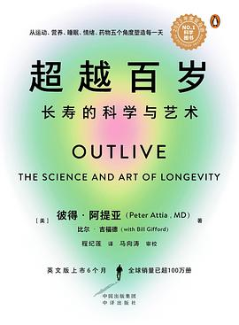

读完了英文版。这本书很有意思，刷新了我对「长寿」 (Longevity) 的认知，里面提到一个概念：我们要专注于延长我们的 healthspan （健康寿命）而不是 lifespan (岁数寿命).

一年前在玉鸟集 @jiananshi2 临别前送了我一本《你是你吃出来的》，本来我对这样的「养生书」是没有一点兴趣的，但我相信一定是一本好书才会选择作为礼物送我，所以我还是一看究竟。读完后我对日常饮食有了很大的改观，开始按照书里的理论改变我每天的饮食结构，例如用复合型碳水食品代替精制食品作为主食、在正餐中搭配更多含维生素的蔬菜水果、减少糖类的摄入等等，也开启了我的「一个月不吃外卖计划」。

我一向很喜欢这种对于身体的科学实践（力量训练也是其中一种），这次读完 Outlive, 让我更深入地了解到了除了饮食以外如何更健康地活得更久。

这本书的结构也很清晰，他把如何长寿这个课题分为目标、战略、战术：长寿的目标是什么？要达到长寿，我们要对抗的是什么？书中首先介绍了人类走向死亡有四大元凶 (Four Horsemen)：心脏病、癌症、神经退化疾病、2 型糖尿病，介绍了它们的病理，然后通过饮食、运动、睡眠、心理健康四大块作出对抗它们的战术。

这本书只是很好地归纳出了一个长寿的战术框架，具体的实践我觉得不是很深入，最好是读完后，分别再读饮食、运动、睡眠、心理健康各个领域最权威的科普书，去定制自己的实践方法。

最后分享一个我印象很深的书中提到关于饮食的一个地方，他说如果你不知道吃什么是对的，那就不要吃那些你奶奶不认识的食物。