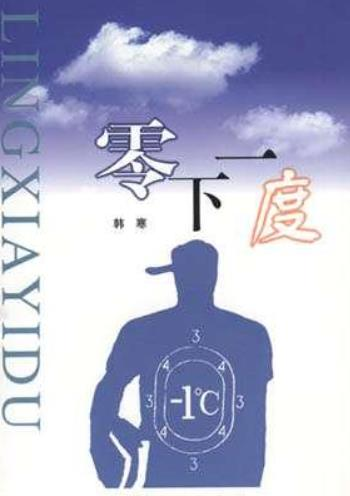
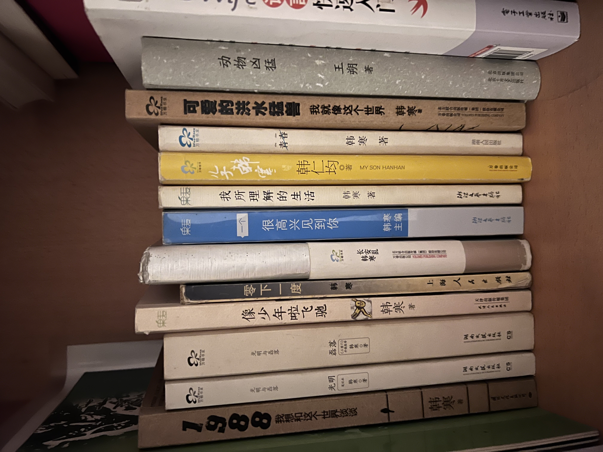
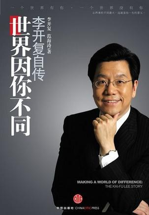
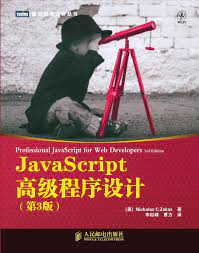
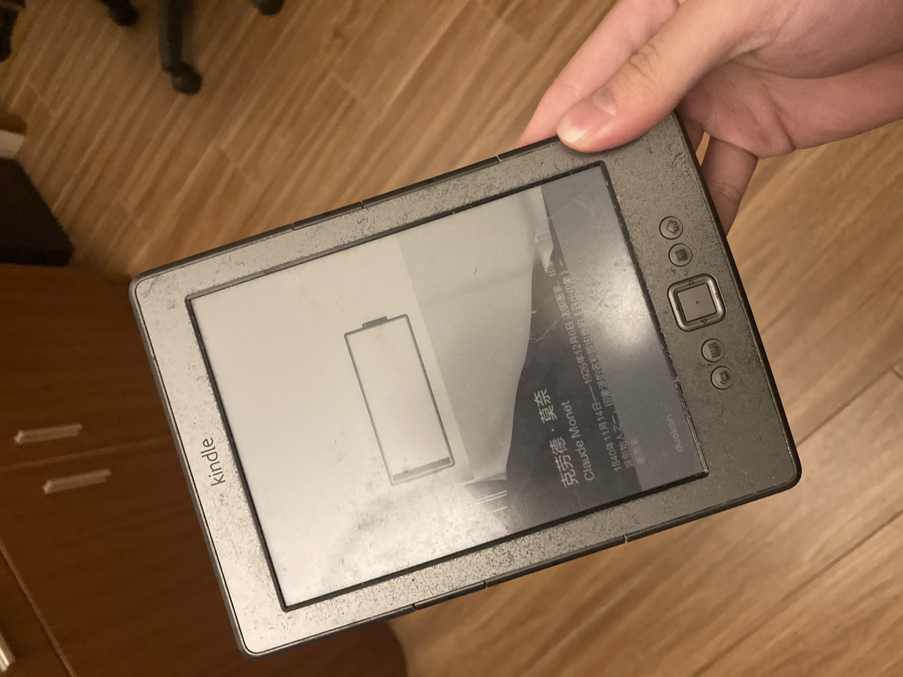
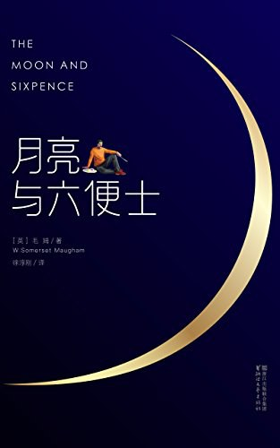

欢迎来到我的读书乐园，我会把我和读书相关的一些想法和书评从我的博客单独出来，分享在这个地方。

## 我和书的结缘

我从很小的时候开始养成了读书的习惯，这么多年来，我见过有因为好读书有优越感的，有因为不读书有羞耻感的，我觉得这样的想法都不是太健康。也有人会说，很羡慕 Randy 可以坚持读书。每当这种时候，除了极力控制自己即将涌上心头的优越感之外，我还会想跟他们分享我为什么会有读书的习惯。但是这个话题太大了，别人也不一定有兴趣听我唠叨。所以在这个属于我的读书乐园，我倒是能认真地和大家分享读书这回事。

我大概从基本识字开始阅读，**我想最大的原因是家里除了读书，没有什么娱乐活动可以供我消遣**。小时候家里虽然有电脑，但每天只能玩两个小时。另一个很重要的原因是家里的书柜刚好是放在了我的房间，所以我有很大的自由度去选书来读。家里人也从来没有主动地要求我阅读。这也电子书永远比不上纸质书的一个点：它是实物，你可以放在那里，随手就可以取得。**如果你想让你的孩子也读一些书，那不妨在他们的周围多放一些书，可能他们自然而然就会拿起来读了**。

我没有我的朋友那么幸运，从小就能接触游戏机、电脑游戏、动画片。所以我只能通过读书来找一点乐子。

刚开始读的是《老夫子》，严格来说它不算书，只能算是漫画。但是《老夫子》有一个特别的地方在于每一篇漫画的标题都是成语，所以我在很小的时候接触了很多成语，什么「飞来横祸」、「打抱不平」等等。再年长一点，我就开始读《小王子》，那时候没有读懂，只觉得有趣，一个男孩来到不同的星球，遭遇了不同的趣事。没有读懂玫瑰和狐狸对小王子的爱的不同意义。**这也让我意识到，读书很讲究时机，不同的经历背景下读同一本书，会有完全不同的感觉。所以说有些书是适合在不同的阶段重复阅读的**。读书不是一件追求读过的任务。

那时我还没主动要求过家人给我买书，书柜里的书都是我姐姐买的，我只是选些书名有趣的书来读。写完作业读，上厕所读。每次要上厕所，我也要憋着先从书柜里精选一本书带进厕所。我不觉得这是因为我对阅读如饥似渴，我只是想在上厕所的时候有点事情可以做。如果当时我有一台 Gameboy, 那我应该还是会选择打着 Gameboy 上厕所的。

这让我直到现在，当我每次到书店或者其它充斥着书本的地方的时候，我总会想上厕所。一开始我以为是纸质书会释放某种有利于排遗的化学物质，后来我上网查了很久，都没有这样的研究结论，所以我觉得这是我从小这样的习惯形成的一种应激反应。我的大脑把书和上厕所联系在了一起。

再长大一些，大概是快要上初中的时候，我开始读一些小时候看书名不太感兴趣的书来读。印象中的第一本就是韩寒的《零下一度》。

这本书打开了我的新世界，韩寒讨论的社会议题、玩的文字游戏、有点古怪的短篇小说、对文学的评论，都让我觉得非常新鲜。也是从读了这本书开始，我非常喜欢写作，我想写出像这样带点自己思考的文字，无论这些思考在别人看来是对的还是错的。就这样我成了韩寒的忠实粉丝，他的每一本书我都读过两遍以上，我的书柜也有两格是专门放韩寒的书的。

除了书柜里姐姐买的书，我姐也会在假期的时候带我到镇上的购书中心读书。我们在那里一待就是一天，从早上购书中心还没开门我们就在门口等，一直到傍晚我的父母下班接我们回家。

有时候我会觉得沮丧，为什么别人家的孩子都在家里看动画片，打游戏机，而我只能在书店里读书。但在书店里读书，对我来说也挺快乐，只是那种快乐是不一样的。

那时我刚接触编程，所以在书店里会选一些关于编程的书来看。但技术书对当时的我来说还是有点晦涩，所以我会去人物传记区找写代码的成功人士的传记来读。那时候在我的眼里，比尔盖茨和微软是神一样的存在（谁能想到多年后我也有幸在微软工作呢🤣），我读了他一些传记，记录了他从小接触编程到他创立微软的经历，看得我热血沸腾。我想我对做产品、做企业的热血，就是在那时候开始有的。

读过比尔盖茨的传记，我觉得还是不够，就再去找关于微软的书。无意中发现了一本书，是李开复的《世界因你不同》。在这本书里也有提到开复在微软工作的经历，所以我对这本书很有兴趣。刚好我姐说可以给我买一本书，我就选了这本。

**这本书可能对很多人来说只是一本普通的书，但对当时的我来说，它彻彻底底改变了我整个人生**。

就像这本书的书名一样，这本书让我想要改变世界的热情达到了一个顶点。这本书以开复在国外读书、工作的整个经历作为主线，穿插着他对人生价值的看法。整一本书都在潜移默化地跟我灌输这样的价值观：人活着就要尽量做一些能影响世界的事情，这个世界是可以因为你而不同的，不要害怕选择一条少有人走的路。

除了他的经历让我羡慕之外，我也从他的经历找到了我人生的意义是什么。我也要像他一样，做一个程序员，做一个可以参与能影响世界的项目的程序员，我要用代码改变世界，不能做一个平庸的人。

在之后的很长一段时间，为了精进我的编程技术，我读的书都是关于技术的，这里就不详细赘述。但有一本书不得不提，那就是《JavaScript 高级程序设计》，这本书陪伴了我高中整整三年。

很久以后有一次技术活动，我有幸和译者曹力同台吃饭，我说我是看你翻译的书长大的。我们都笑了。但他不晓得这本书对我的影响有多大。

高中除了读技术书，我还因为对前途的迷茫，开始读一些虚构类的作品，希望能从这些书里找到我的人生答案。整个高一高二，如果你在教室里发现我不见了，基本上我都是在学校的图书馆。以至于我的借书证后来都被我用烂了。

当时我很迷茫，因为读书成绩很差，也不知道有没有机会做一个程序员。带着这样的迷茫，我读了很多和技术没关的书。首先是从韩寒的书里发现的很多近代文学作品和当代文学作品，像梁实秋、胡适、李敖、王小波、钱钟书等等。然后从这些人的作品里开始接触一些西方哲学相关的作品，也是在那个时候，我对哲学充满了兴趣。

在我高二那年，我姐姐说要送我一个成年礼物。我说我想要一台 Kindle, 于是她淘了一台二手的 Kindle 4 送给了我。

过了这么多年，每当回忆起这件事情，我还是会感动得想哭，这是我这辈子到现在为止收到过最好的礼物，我用它读了很多改变了我的书。

因为我住校，每个月大概就回一两次家。有了 Kindle 后，每次回家我都会上网找口碑最好的书存到我的 Kindle, 为我的枯燥学校生活补充弹药。在这样的契机下，我接触到了毛姆，因为每个人都说《月亮与六便士》是一本很好的书。我也没有免俗，读了这本书。

我受到很大的冲击，这本书的理想主义像潮水一样扑到我的脸上，我被感动、被震撼，又觉得无能为力，因为我还是一个考试都考不好的差生。

我开始疯狂读毛姆，其中《刀峰》在我心中，比《月亮与六便士》更能打动我。后者的理想主义太过于纯粹，纯粹得有点不真实，但《刀锋》的理想主义更加真实，还带着一些哲学，以及哲学尽头的神秘主义。这本书也让我感受到，每个人的人生都有不同的活法，穷困和富裕只是两种不同的状态。从此，我的心中一直存在着一个拉里（书中的男主人公）。

## 我如何选书

接下来分享一下现在的我是如何选书的。这也是很多人问过我的一个问题。

### 朋友分享的书

我目前大部分的书是来自我朋友的分享，或者在社交网络看到的书。我主要用 Twitter, 所以我经常能看到我关注的人分享他们读下来觉得不错的书，我会立刻记下来，加进我的书单中。

我认为你关注的、你欣赏的人分享的书是最有参考价值的，这比豆瓣评分更适合自己。

<!--  -->

### 书中提到的书

我经常能从正在读的书中发现很多好书。比如上文提到的我从韩寒写的书就发现了很多近代文学作品。偶尔在一些非虚构类的书籍里，也会引用其它书，我都会看一看是否是我感兴趣的书。

### 逛书店

我喜欢逛书店。比如离职后我在上海待了几天，整个行程的主线就是围绕着上海的书店规划的。逛书店可以发现当下最流行的书，虽然不一定都适合自己，但可以很随机地找到一些和你有缘的书。独立书店一般都有自己的选品，也会让你发现一些你没听说过的书。

### 榜单

近几年用微信读书后，我也会关注微信读书的飙升榜和热搜榜，可以发现很多当下流行的好书。这些书不一定是新书，但很有可能是和当下社会热点事件相关的书。

## 我如何读书

虚构类作品没有什么方法论。对于非虚构类的书来说，开始读一本书时，我一般会粗略看看目录，知道整本书大概的结构。这样我就会大概知道我应该重点读哪个部分。有时不一定整本书都要读完，对于很大部头的非虚构类书籍，我很可能只挑我感兴趣的部分来读。

目前我阅读的设备是 iPad mini 6 和 Boox Leaf 2. 前者主要用于阅读英文书籍，因为 iPad 比较方便查词，后者主要用于阅读微信读书的中文书籍。我很喜欢墨水屏的质感。

最近一两年我对阅读英文书籍的方式有所改变，因为开始使用 [沉浸式翻译插件](https://immersivetranslate.com/), 我会先用它把书做成中英对照的版本，然后在 iPad 上阅读。这大大加速了我阅读英文书籍的速度。

在阅读的过程中，我会在引发我思考或者获得了新知的地方划线。**在划线的同时，我会强迫自己一定要写上自己的想法**。因为我发现如果只划线不写想法，以后再读划线部分，会想不起来当初的想法是什么。写下想法也是内化知识的一个过程。

读完后，我会按照我的划线，重新粗略地跳读整本书。这个过程对我来说的作用是加强我对这本书整体结构的认知。有时候在这个过程中，会发现我第一遍阅读时没有注意到的地方。

最后我会使用 [Notepal](https://notepal.randynamic.org/) 把微信读书的划线和想法同步到 [Readwise](https://readwise.io), Readwise 能帮助我随机回顾我曾经划线的内容。

偶尔在长途驾驶的时候，我也会选择听书。用的是微信读书自带的 AI 朗读。经过了多年的训练，这几年的 AI 朗读已经很成熟，听上去也很自然。我从苏州开车回广州的路上就听完了几本书。听书比较适合听非虚构类的书籍，虚构类的书我觉得还是沉浸式地去阅读会更有感觉。

## 读书还有必要吗？

自从有了互联网，有了很多除了文本以外的知识载体，书籍就变成了不是唯一一种获取知识和体验的方式了。我其实想不到读书有什么「秒杀」其它方式的优点，我自己也经常从 YouTube, 电影、博客之类的渠道获取知识，我不觉得读书和这些渠道有什么本质上的区别。它们只是把知识放到了不同的载体，你喜欢什么样的载体，就用什么样的载体。

比如可能 YouTube 上就有很好的关于某个心理学知识的视频，你看完学到了很多，这不比你读一本完整的心理学书差。打个不严谨的比方，就像在这个年代去对比 Switch, PS 和 Xbox, 能比的也就是不同平台的独占内容了。

因此读不读书，我个人觉得并不值得纠结。